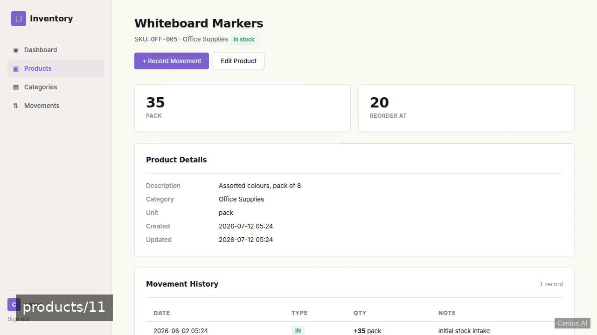
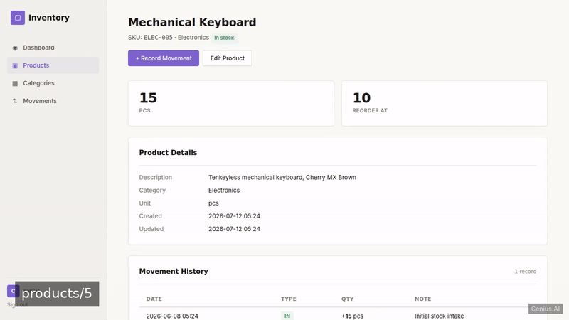
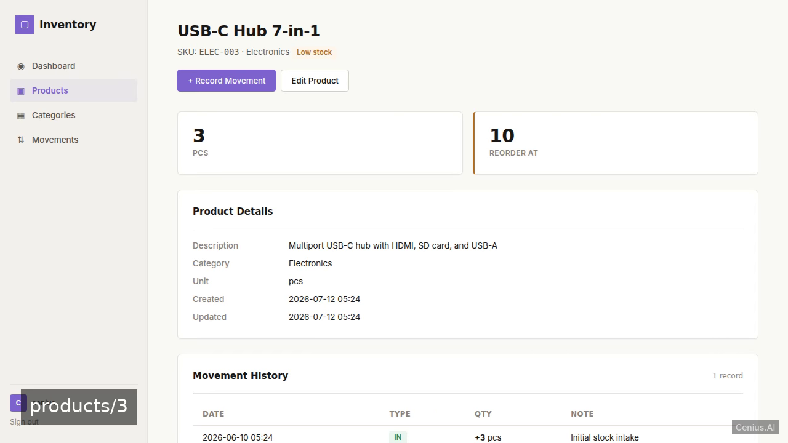
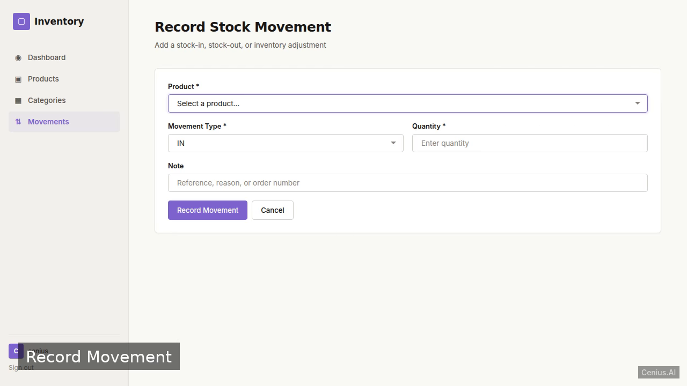

# Warehouse Inventory Manager — production-ready FastAPI monitoring dashboard starter

Build a polished, production-quality MVP for warehouse inventory management. That's **Warehouse Inventory Manager** — a Apache-2.0-licensed, open-source monitoring dashboard in FastAPI you can self-host and modify freely. Fork Warehouse Inventory Manager, run it, or [remix it on cenius.ai](https://cenius.ai/marketplace/p/warehouse-inventory-manager?ref=gh&utm_campaign=warehouse-inventory-manager-fastapi) for a custom Warehouse Inventory Manager build with full rebrand rights.


[](LICENSE)  [](https://cenius.ai)

[](https://cenius.ai/marketplace/p/warehouse-inventory-manager?ref=gh&utm_campaign=warehouse-inventory-manager-fastapi)

> **▶ [Open & edit in cenius.ai](https://cenius.ai/marketplace/p/warehouse-inventory-manager?ref=gh&utm_campaign=warehouse-inventory-manager-fastapi)** — one click to an editable workspace: describe changes in plain English, get an instant preview, one-click deploy and host. Modifications made on the platform come with full rebrand & relicense rights.

_Local clone? See [Quick start](#quick-start) below. cenius.ai is the zero-setup path._

## Demo





▶ **[Video walkthrough](https://cenius.ai/marketplace/p/warehouse-inventory-manager?ref=gh&utm_campaign=warehouse-inventory-manager-fastapi)** — see the app in action on the cenius.ai project page · [MP4 file](.github/media/demo.mp4)

## Screenshots

  

## Quick start

```bash
./install.sh   # installs dependencies + seeds demo data
```

See [`INSTALL.md`](INSTALL.md) for full setup and usage instructions.

## Architecture

Open the repo and you'll find a complete FastAPI application (35 files). Top-level layout: `routers/`, `static/`, `templates/`. Starting up is just `./install.sh`: it installs what is needed and pre-fills the database so you have data to work with straight away. For environment-specific setup, see [`INSTALL.md`](INSTALL.md).

## Usage guide

### Accessing the application

Start the server (see [INSTALL.md](INSTALL.md)) and open `http://127.0.0.1:8000` in a browser.

### Login

The seed data creates two users:

- **Admin**: `admin@example.com` / password = value of `ADMIN_PASSWORD` env variable
- **Demo**: `demo@example.com` / password = value of `DEMO_PASSWORD` env variable

Use the login form at `/auth/login` (or the root `/` when not authenticated).

### Dashboard (Overview)

After login you are redirected to `/` which shows the overview dashboard:
- Total number of products and categories
- Lists of low‑stock items (current stock ≤ reorder point) and out‑of‑stock items
- Breakdown of products by category

### Managing Categories

- **List**: `/categories` – view all categories
- **Create**: `/categories/create` – add a new category (name, description)
- **Edit**: `/categories/{category_id}/edit` – modify a category
- **Delete**: POST to `/categories/{category_id}/delete` (button on the list or edit page)

### Managing Products

- **List**: `/products` – search by name/SKU, filter by category
- **Create**: `/products/create` – enter SKU, name, description, category, stock levels, unit
- **View detail**: `/products/{product_id}` – shows product info and current stock
- **Edit**: `/products/{product_id}/edit`
- **Delete**: POST to `/products/{product_id}/delete`

### Stock Movements

- **List**: `/movements` – view all stock‑in/stock‑out records
- **Create**: `/movements/create` – record a stock‑in or stock‑out for a product, adjusting the current stock automatically

### Health Check Endpoint

_Full guide: [`USAGE.md`](USAGE.md)_

## FAQ

### Can I deploy Warehouse Inventory Manager on my own infrastructure?

`git clone` + `./install.sh` gets you a running instance — the install script provisions dependencies and demo data. Full steps live in [`INSTALL.md`](INSTALL.md); nothing external is needed to try it.

### Is Warehouse Inventory Manager free for commercial use?

The code is under the Apache-2.0 license, which allows commercial use without restriction. You can build, sell, and deploy it freely. Full text: [LICENSE](LICENSE).

### Can I change Warehouse Inventory Manager without writing code?

[cenius.ai](https://cenius.ai/marketplace/p/warehouse-inventory-manager?ref=gh&utm_campaign=warehouse-inventory-manager-fastapi) handles the implementation. Tell it what you want in everyday words, pick up the updated build. No coding needed.

### Which technology stack does Warehouse Inventory Manager use?

Powered by FastAPI. This repo is the real thing — full source, seed data, and all — ready to clone and start up.

### How do I make Warehouse Inventory Manager my own brand?

White-labeling is supported: fork the MIT-licensed source and rebrand it yourself, or use [cenius.ai](https://cenius.ai/marketplace/p/warehouse-inventory-manager?ref=gh&utm_campaign=warehouse-inventory-manager-fastapi) to make changes in a guided workspace — platform modifications come with full rebrand rights.

## License & rebranding

Released under the [Apache License 2.0](LICENSE) (© 2026 Cenius AI) — free for personal and commercial use. The Cenius name/logo are trademarks (see NOTICE).

**Need a customized version?** [Remix this app on cenius.ai](https://cenius.ai/marketplace/p/warehouse-inventory-manager?ref=gh&utm_campaign=warehouse-inventory-manager-fastapi) — modifications made on the platform come with **full rebrand & relicense rights** over your derivative.

## Built with cenius.ai

This entire application — code, design, seeded demo data — was generated on **[cenius.ai](https://cenius.ai)** from a plain-English description.

- 🚀 [Build your own app on cenius.ai](https://cenius.ai)
- 🎛️ [Remix Warehouse Inventory Manager on the marketplace](https://cenius.ai/marketplace/p/warehouse-inventory-manager?ref=gh&utm_campaign=warehouse-inventory-manager-fastapi) — open it in a workspace, prompt for changes, and ship your own version.

More open-source apps: [the Cenius-ai catalog](https://github.com/Cenius-ai) · [showcase index](https://github.com/Cenius-ai/showcase)
